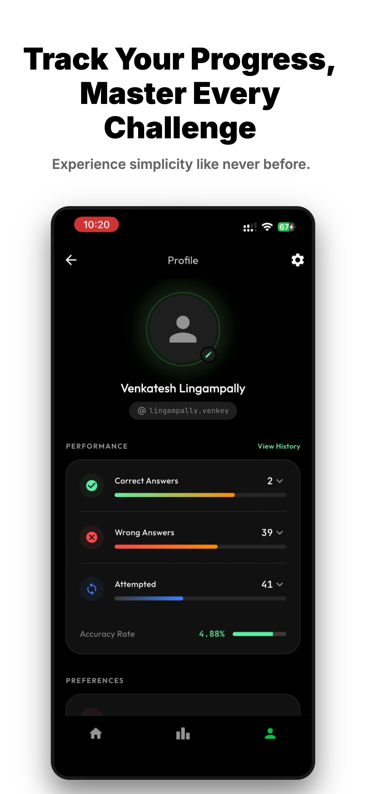
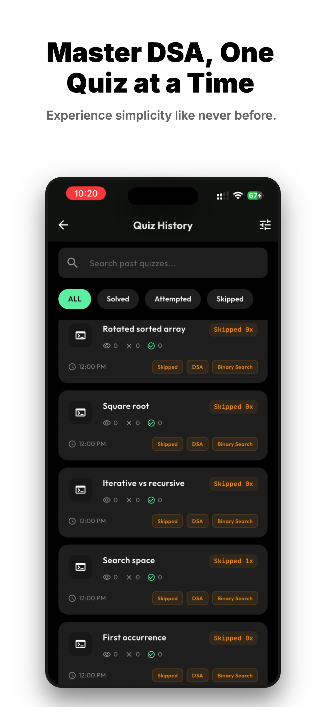
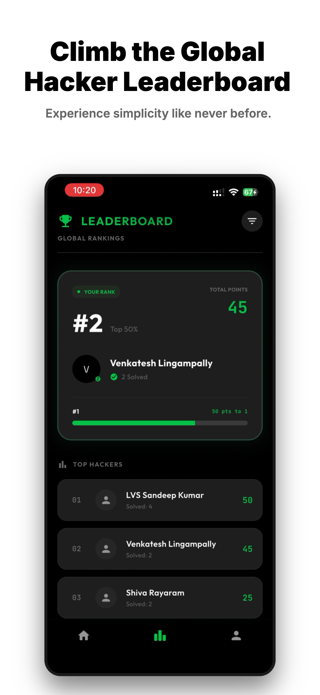
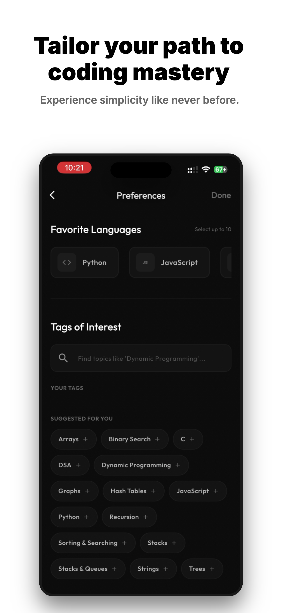

# 🚀 LeetScroll: Master Coding. Daily.

[](https://flutter.dev)
[](https://dart.dev)
[](https://opensource.org/licenses/MIT)

**LeetScroll** is a gamified, mobile-first platform designed to turn your daily coding practice into an addictive, high-reward experience. Whether you're prepping for FAANG interviews or just sharpening your DSA skills, LeetScroll keeps you engaged with a "Vibe Learning" feed, global competition, and deep progress tracking.

---

## ✨ Key Features

### 🧵 Vibe Learning Feed
Experience coding problems like never before. Scroll through a curated feed of challenges designed for quick consumption and deep understanding. Swipe, solve, and level up.

### 📊 Comprehensive Performance Tracking
Don't just solve—understand your growth. Track your **Accuracy Rate**, **Attempt History**, and **Problem-Specific Stats** with intuitive, beautiful visualizations.

### 🏆 Global Leaderboard
Climb the ranks and compete with "Top Hackers" worldwide. Earn points, unlock tiers (Bronze to Gold), and see how you stack up against the global coding community.

### 🧩 Tailored Learning
Customize your experience by selecting your **Favorite Languages** and **Tags of Interest**. Whether it's *Dynamic Programming in Python* or *Systems Design in Go*, LeetScroll adapts to your goals.

### 📅 Daily Goals & Activity
Keep your streak alive with daily goals and a GitHub-style contribution heatmap. Consistency is the secret to mastery, and we make it visible.

---

## 📸 Experience Simplicity Like Never Before

<p align="center">
  
  <br>
  <b>Track Your Progress, Master Every Challenge</b>
</p>

<p align="center">
  
  <br>
  <b>Master DSA, One Quiz at a Time</b>
</p>

<p align="center">
  
  <br>
  <b>Climb the Global Hacker Leaderboard</b>
</p>

<p align="center">
  
  <br>
  <b>Tailor Your Path to Coding Mastery</b>
</p>

---

## 🛠️ Tech Stack

- **Framework:** [Flutter](https://flutter.dev)
- **State Management:** [Flutter BLoC](https://pub.dev/packages/flutter_bloc) (with Hydrated BLoC for persistence)
- **Navigation:** [AutoRoute](https://pub.dev/packages/auto_route)
- **Dependency Injection:** [GetIt](https://pub.dev/packages/get_it) + [Injectable](https://pub.dev/packages/injectable)
- **UI & Styling:** Google Fonts (Outfit, JetBrains Mono), Custom Dracula/VS Code inspired themes.
- **Networking:** [Dio](https://pub.dev/packages/dio) + [Retrofit](https://pub.dev/packages/retrofit)
- **Persistence:** [Shared Preferences](https://pub.dev/packages/shared_preferences)

---

## 🚀 Getting Started

### Prerequisites
- Flutter SDK `^3.24.0`
- Dart SDK `^3.5.0`

### Installation
1. **Clone the repository:**
   ```bash
   git clone https://github.com/yourusername/leet-scroll.git
   cd leet-scroll
   ```

2. **Install dependencies:**
   ```bash
   flutter pub get
   ```

3. **Run Code Generation:**
   ```bash
   flutter pub run build_runner build --delete-conflicting-outputs
   ```

4. **Run the app:**
   ```bash
   flutter run
   ```

---

## 🤝 Contributing

Contributions are what make the open-source community such an amazing place to learn, inspire, and create. Any contributions you make are **greatly appreciated**.

1. Fork the Project
2. Create your Feature Branch (`git checkout -b feature/AmazingFeature`)
3. Commit your Changes (`git commit -m 'Add some AmazingFeature'`)
4. Push to the Branch (`git push origin feature/AmazingFeature`)
5. Open a Pull Request

---

## 📜 License

Distributed under the MIT License. See `LICENSE` for more information.

---

<p align="center">
  Made with ❤️ for the Coding Community
</p>
